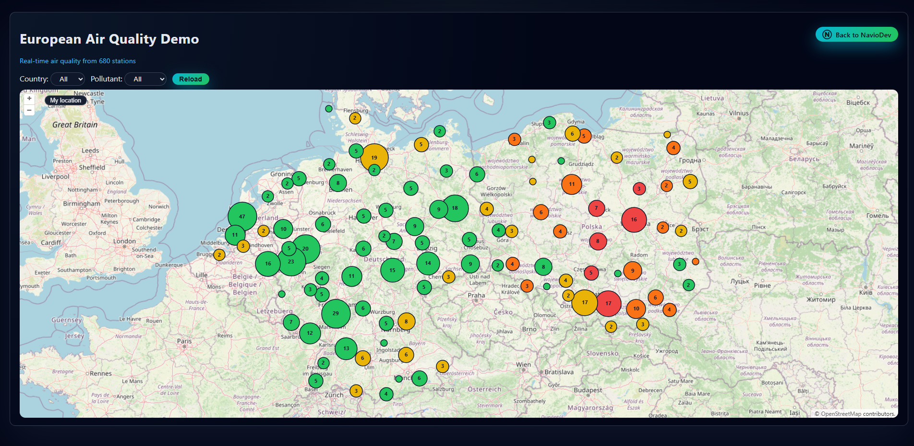
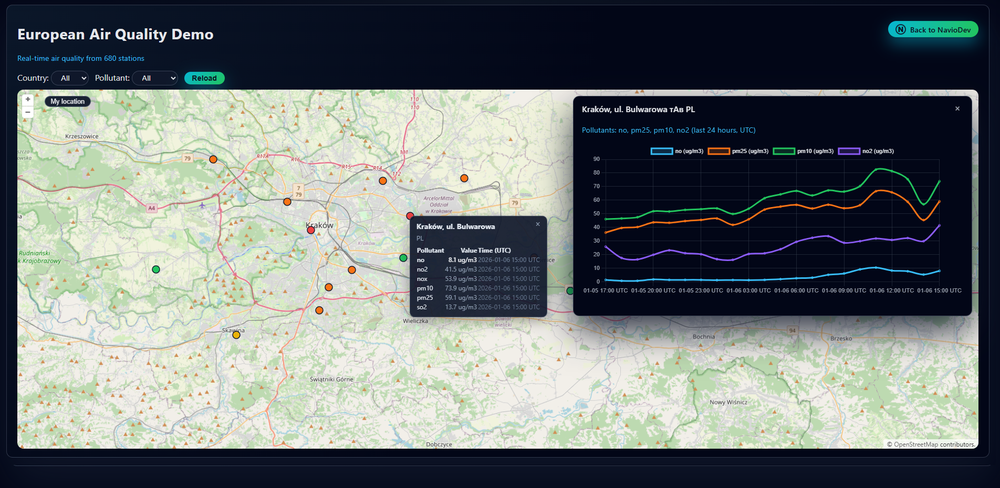
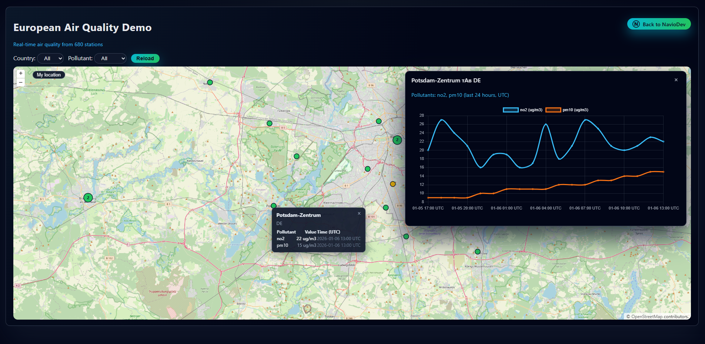
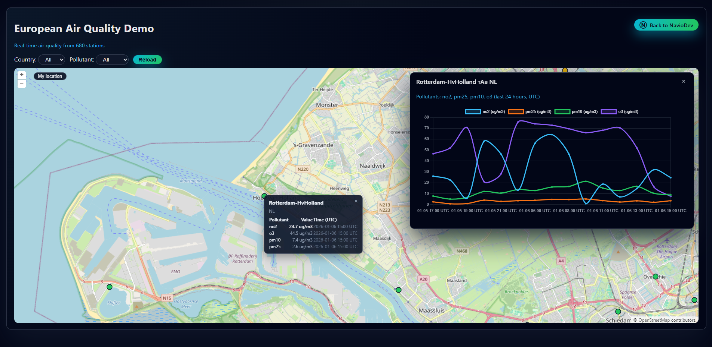

# AirQuality Suite

Air quality data platform built as a set of microservices: producer, streaming, API, and web client.

Demo: https://air.naviodev.com

## Screenshots

## Repositories
- airquality-data-pipeline: https://github.com/aliaksandrgis/airquality-data-pipeline
- airquality-spark-jobs: https://github.com/aliaksandrgis/airquality-spark-jobs
- airquality-airflow-dags: https://github.com/aliaksandrgis/airquality-airflow-dags
- airquality-geo-api: https://github.com/aliaksandrgis/airquality-geo-api
- airquality-web-client: https://github.com/aliaksandrgis/airquality-web-client

## Data sources
- Germany: UBA API
- Netherlands: Luchtmeetnet API
- Poland: GIOS API

## Stack
Airflow, Kafka (Confluent Cloud), Spark, Supabase (Postgres), FastAPI, static web UI.
